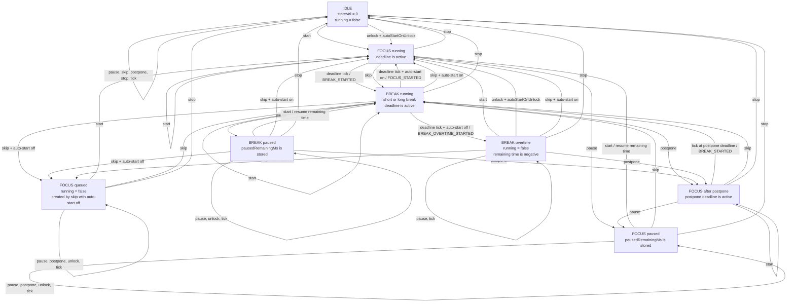
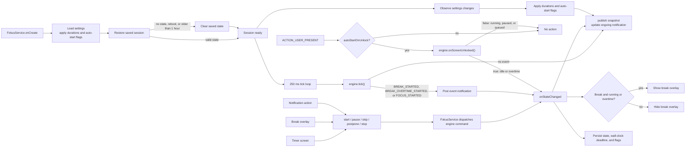

# Timer Flow

This document describes the `TimerEngine` state machine and the
`FokusService` paths that drive it. `BREAK` means either a short break or the
long break after the last focus session in a cycle.

## Engine State Machine

### Transition Rules

| Case | Result |
| --- | --- |
| Start from idle | Starts focus session 1. |
| Focus deadline expires | Starts the next break automatically. |
| Break deadline expires with auto-start enabled | Starts the next focus automatically and emits `FOCUS_STARTED`. |
| Break deadline expires with auto-start disabled | Stops the timer in overtime and emits `BREAK_OVERTIME_STARTED`. |
| Skip during focus | Starts the current focus session's break immediately. |
| Skip during a break with auto-start enabled | Starts the next focus immediately. |
| Skip during a break with auto-start disabled | Cues the next focus without starting it. `start()` is required. |
| Start during overtime | Advances to and starts the next focus. |
| Postpone during a break or overtime | Runs the preceding focus for the postpone duration, then returns to the same break. |
| Pause while running | Stores the remaining time and stops countdown; `start()` resumes it. |
| Stop from any active, paused, queued, or overtime state | Resets to idle and discards the cycle position. |
| Screen unlock with auto-start enabled | Starts focus only from idle or overtime. Running, paused, and queued states are unchanged. |

`nextState()` advances focus to its break and break to its next focus. After
the long break, the cycle wraps to focus session 1. A focus has an odd
`stateVal`; a break has an even `stateVal`.

## Service, UI, and Persistence Flow

The service persists the deadline rather than only the remaining time, so
elapsed wall-clock time continues to count while the process is stopped. The
tick loop starts only after settings and session restoration are complete.
